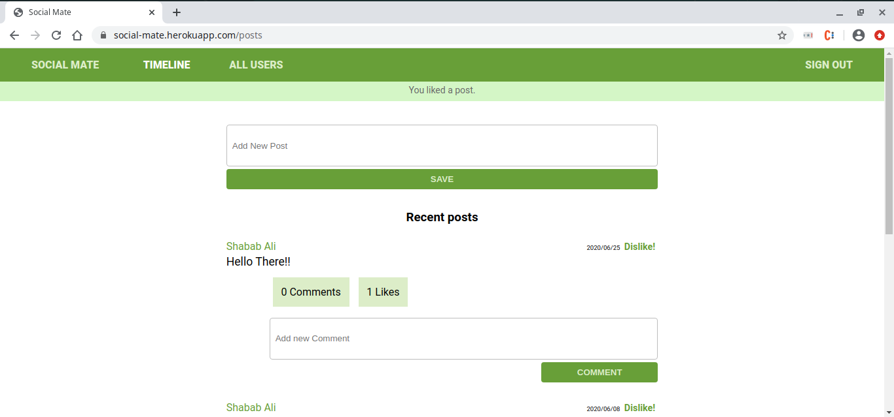

[](mailto:consult.ikraam@gmail.com) [](https://twitter.com/GhoorIkraam)

[](mailto:shababsaifi@gmail.com) [](https://twitter.com/shabab_ali)

# Social Media Project

> In this project, we first designed an [ERD diagram](https://github.com/ikraamg/Social-Media/blob/milestone1/docs/Social%20Media%20ERD.pdf) which visually displays the database schema and structure.
> We then added a friendship functionality using self-referencial relationships to the forked repositry.Database query improvements were made ontop of the friendship funtionality
> OmniAuth via Twitter is enabled, allowing users to login via their twitter accounts.
> Friends can be added via a request. A request can be cancelled by user or rejected/confirmed by friend.
> 51 tests are run using rspec unit tests for the models, rspec controller tests and then capybara integration tests.





## Built With

- Ruby v2.6.5
- Ruby on Rails v5.2.4.2
- Gems used for testing: Capybara, Rspec-Rails, Shoulda-matchers and FactoryBot, OmniAuth

## Live Demo

[Heroku App Link](https://social-mate.herokuapp.com/)

## Getting Started

To get a local copy up and running follow these steps:

### Prerequisites

- Ruby: 2.6.3
- Rails: 5.2.3
- Postgres: >=9.5
- Git

### Usage

- Fork/Clone this project to your local machine
- Open folder in your local enviroment and run thes lines of code to get started:

Install gems with:

```Ruby
    bundle install
```

Setup database with:

```Ruby
   rails db:create
   rails db:migrate
```

Start server with:

```Ruby
    rails server
```

Then open a web page and go to [port 3000 on your local machine.](http://localhost:3000)

### Running tests

```Ruby
    bundle exec rpsec --format documentation
```

### Deployment

The application was deployed on herouku.
To deploy your own copy, you can follow the following [steps:](https://devcenter.heroku.com/articles/git)

## Authors

👤 **Ikraam Ghoor**

- Github: [@ikraamg](https://github.com/ikraamg)
- Twitter: [@GhoorIkraam](https://twitter.com/GhoorIkraam)
- LinkedIn: [isghoor](https://linkedin.com/isghoor)
- Email: [consult.ikraam@gmail.com](mailto:consult.ikraam@gmail.com)

👤 **Shabab Ali**

- Github: [@alishabab](https://github.com/alishabab)
- Twitter: [@shabab_ali](https://twitter.com/shabab_ali)
- LinkedIn: [shababali](https://www.linkedin.com/in/shababali/)
- Email: [shababsaifi@gmail.com](mailto:shababsaifi@gmail.com)

## 🤝 Contributing

Contributions and feature requests are welcome!

Start by:

- Forking the project
- Cloning the project to your local machine
- `cd` into the project directory
- Run `git checkout -b your-branch-name`
- Make your contributions
- Push your branch up to your forked repository
- Open a Pull Request with a detailed description to the development(or master if not available) branch of the original project for a review

## Show your support

Give a ⭐️ if you like this project!

## Acknowledgments

Microverse for the [skeleton repository](https://github.com/microverseinc/ror-social-scaffold) which this project was built on.
